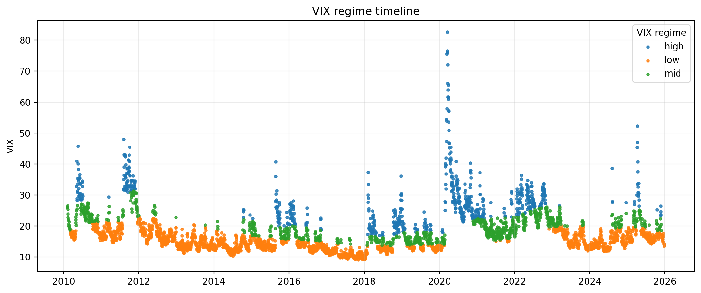
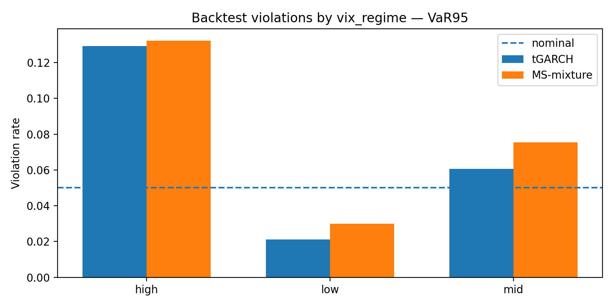
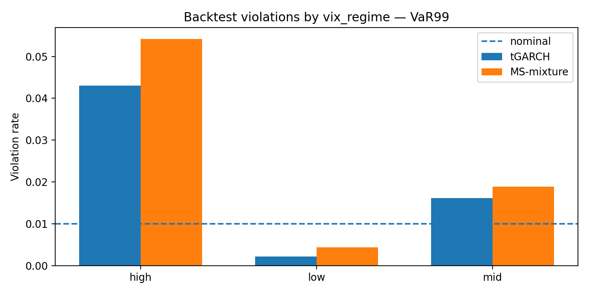
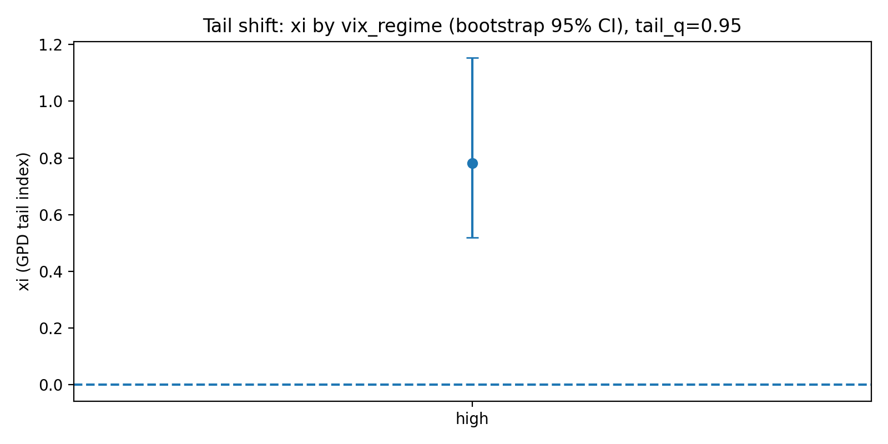
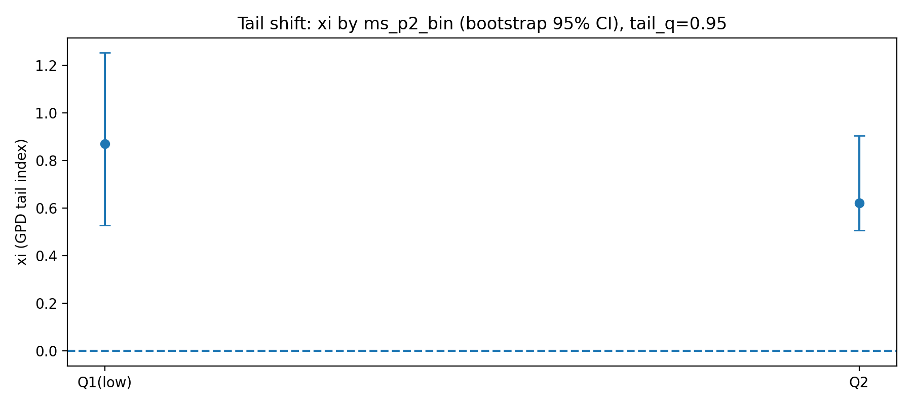
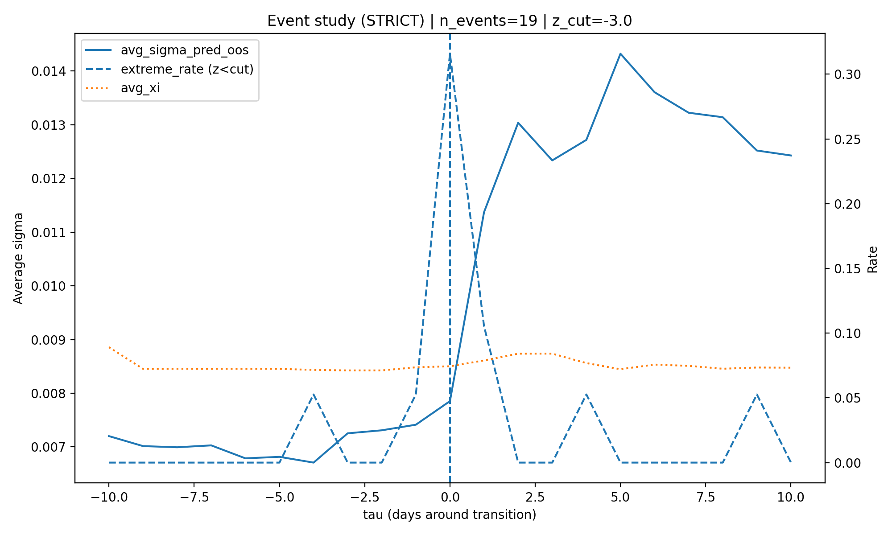
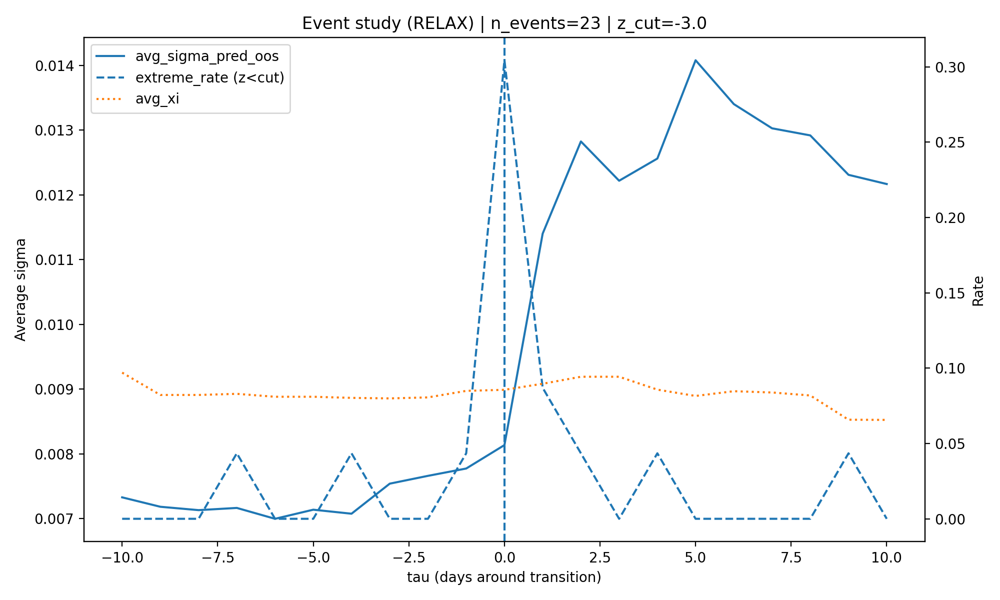
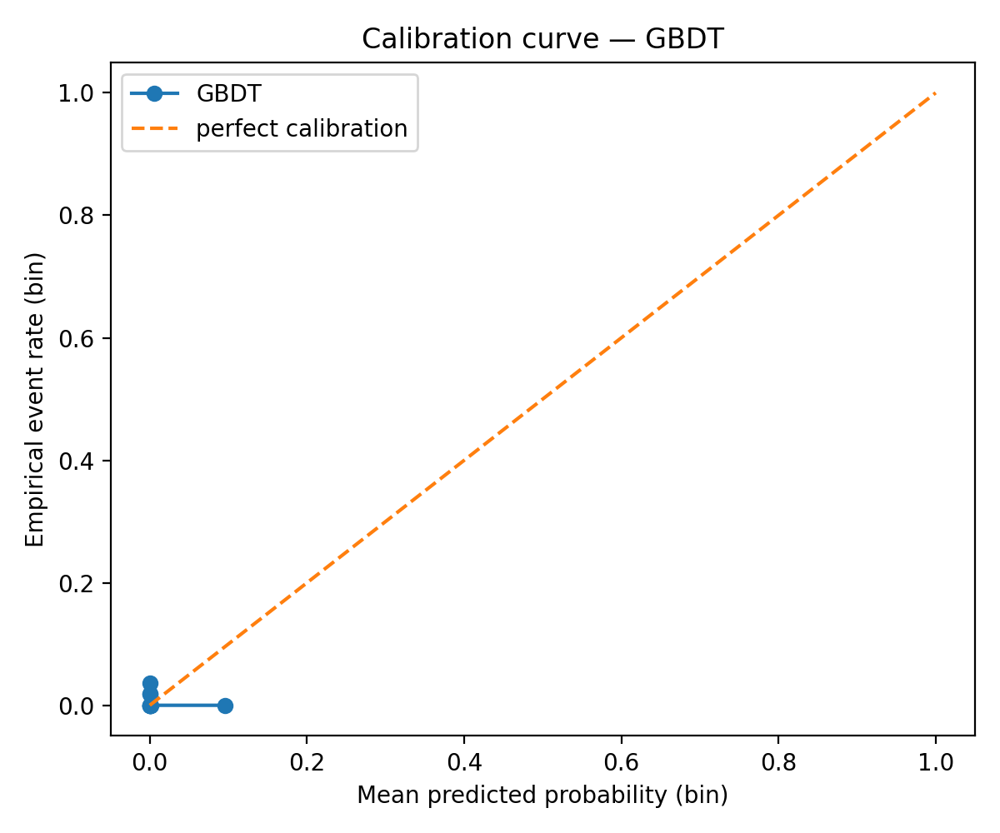
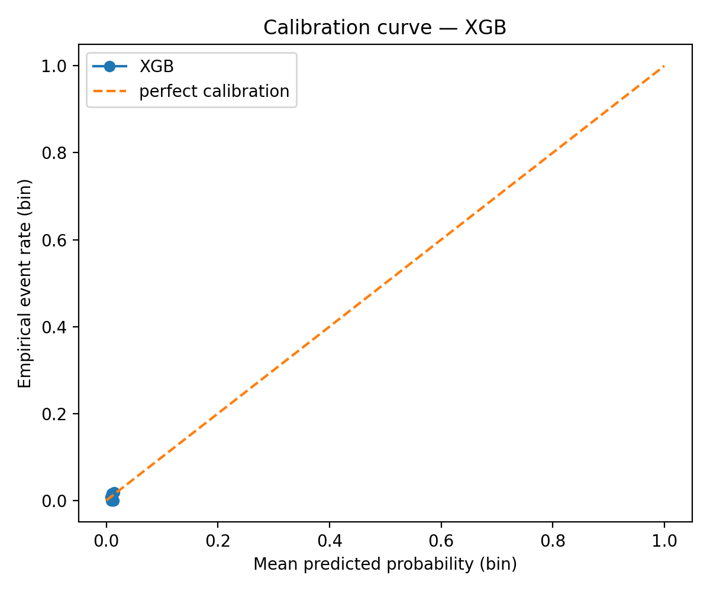

# Regime-Dependent Tail Risk and Regime-Switching Predictive Distributions

## 1. Executive Summary

This project studies a practical model-risk question:

> When a standard Student-t GARCH VaR model underestimates losses during market stress, is the failure explained only by higher volatility, or does the shape of the return distribution also change?

Using daily U.S. equity market data, the analysis finds that VaR breaches are concentrated in high-volatility regimes. This is important because the benchmark model already includes both volatility clustering and heavy-tailed Student-t innovations. The evidence therefore points to a regime-dependent tail-risk problem rather than a simple failure to forecast conditional variance.

The project evaluates this hypothesis through four linked components:

1. Rolling one-step-ahead Student-t GARCH VaR forecasts.
2. Regime-conditional VaR backtesting across calm and stress states.
3. Peaks-over-Threshold Generalised Pareto tail estimation by regime.
4. Regime-weighted predictive distributions using Markov-switching state probabilities.

The main empirical conclusion is that stress regimes exhibit materially higher downside tail risk. Extreme losses are more frequent in high-volatility states, and tail estimates indicate thicker left-tail behaviour during stress. A regime-weighted predictive distribution is tested as a diagnostic extension, but in the current notebook run it does not improve VaR calibration relative to the rolling Student-t GARCH benchmark. This is an important model-risk result: adding regime probabilities is not sufficient unless the regime-specific predictive density is correctly specified.

This is a market-risk and model-validation case study. It is designed to demonstrate applied knowledge of VaR backtesting, volatility modelling, tail estimation, regime detection, stress diagnostics, and model-governance limitations.

---

## 2. Research Question

Standard GARCH models are widely used for conditional market-risk forecasting. A Student-t GARCH(1,1) model improves on Gaussian GARCH by allowing heavy-tailed shocks, but it still assumes that the innovation distribution has a fixed shape through time.

This project tests whether that assumption is too restrictive.

The central research question is:

> Does stress-period VaR under-coverage reflect regime-dependent tail thickening beyond volatility clustering?

The benchmark model uses:

- Rolling parameter estimation.
- One-step-ahead volatility forecasts.
- Student-t innovations.
- VaR95 and VaR99 backtesting.
- Out-of-sample evaluation.

The key diagnostic is not only whether the model fails, but where it fails. If violations are concentrated in high-volatility states, then a single unconditional tail shape may be inadequate for market-risk measurement.

---

## 3. Data

The analysis uses daily U.S. market data from January 2005 to December 2025.

### 3.1 Core Variables

| Variable | Source | Role |
|---|---|---|
| SPY adjusted close / log returns | Yahoo Finance | Main equity return series |
| VIX index | Yahoo Finance | Observable volatility-regime proxy |
| 3-month Treasury yield | FRED | Short-rate and policy-shock proxy |
| 10-year Treasury yield | FRED | Yield-curve and macro-financial context |

### 3.2 Dataset Summary

| Item | Output |
|---|---:|
| Raw aligned market-data shape | `(5,282, 4)` |
| Raw data range | `2005-01-03` to `2025-12-30` |
| Final modelling sample | `4,001` observations |
| Rolling GARCH out-of-sample sample | `2,741` observations |

### 3.3 Regime Counts

VIX regimes are defined using rolling quantiles with no look-ahead bias.

| VIX regime | Observations |
|---|---:|
| Low | 2,327 |
| Mid | 940 |
| High | 734 |

Policy-shock labels are used as supplementary explanatory variables rather than as the main regime definition.

| Policy regime | Observations |
|---|---:|
| Hold | 2,846 |
| Tightening shock | 611 |
| Easing shock | 544 |

### 3.4 Data Notes

- SPY log returns are the main risk series.
- VIX is used to classify observable volatility regimes.
- Treasury yield changes are used for supplementary macro-policy diagnostics.
- Data are downloaded directly in the notebook.
- A FRED API key is required for the Treasury-yield components.

A more production-ready version should include cached data files or a fallback data-loading path so the notebook can be reproduced without live API access.

---

## 4. Methodology

### 4.1 Rolling Student-t GARCH Benchmark

The benchmark model is a rolling Student-t GARCH(1,1) model estimated on historical return windows.

For each out-of-sample date, the model produces one-step-ahead VaR forecasts at the 95% and 99% confidence levels.

The benchmark is evaluated using:

- Violation rates.
- Kupiec unconditional coverage tests.
- Christoffersen independence tests.
- Christoffersen conditional coverage tests.
- Regime-conditional VaR failure rates.
- Comparison of calm and stress-state calibration.

The purpose of the benchmark is to provide a realistic but interpretable market-risk model against which regime-dependent methods can be assessed.

### 4.2 Observable Regimes Using VIX

The first regime classification uses VIX as an observable stress proxy.

The notebook separates market states into low, mid, and high volatility regimes using rolling VIX quantiles. These regimes are then used to evaluate whether VaR breaches and extreme losses are concentrated in stress periods.

This provides a transparent, economically interpretable stress classification.

### 4.3 Tail-Risk Estimation Using POT-GPD

The project uses Peaks-over-Threshold Extreme Value Theory to estimate downside tail behaviour by regime.

The tail-risk workflow is:

1. Define extreme left-tail losses.
2. Estimate Generalised Pareto tail parameters above a loss threshold.
3. Compare tail estimates across regimes.
4. Use bootstrap confidence intervals to assess estimation uncertainty.
5. Use bootstrap tests for high-regime versus low-regime tail-index differences.

The aim is to test whether stress states are associated with thicker downside tails, not only larger conditional variance.

### 4.4 Markov-Switching Regime Probabilities

The project also estimates latent volatility-state probabilities using a two-state Markov-switching framework.

The states are interpreted as:

- State 1: lower-volatility / calmer market state.
- State 2: higher-volatility / stress market state.

The estimated probability of the high-volatility state is used as an input to the predictive distribution.

The current notebook implementation should be treated as a research implementation rather than a production-grade MS-GARCH library. It includes numerical stabilisation and approximation steps, which are useful for experimentation but should be documented carefully in model validation.

### 4.5 Regime-Weighted Predictive Distribution

The predictive density is represented as a regime-weighted mixture:

```text
f(r_{t+1}) = (1 - p_t) f_low(r_{t+1}) + p_t f_high(r_{t+1})
```

where:

- `p_t` is the estimated probability of the high-volatility state.
- `f_low` is the predictive density under the low-volatility state.
- `f_high` is the predictive density under the high-volatility state.

This approach changes the full predictive distribution as regime probabilities change. It is more flexible than applying a simple volatility multiplier because it allows the stress-state distribution to contribute directly to tail-risk forecasts.

---

## 5. Empirical Results

### 5.1 Baseline Student-t GARCH Fit

The full-sample Student-t GARCH(1,1) fit shows high volatility persistence and heavy-tailed innovations.

| Parameter | Estimate |
|---|---:|
| omega | 0.024741 |
| alpha[1] | 0.154040 |
| beta[1] | 0.832628 |
| alpha + beta | 0.986668 |
| Student-t degrees of freedom | 5.707818 |

This confirms that the benchmark model already allows volatility clustering and heavy-tailed shocks. Therefore, stress-period VaR failures are not solely due to the use of a Gaussian or non-persistent volatility model.

### 5.2 Markov-Switching Volatility Classification

The fast two-state Markov-switching volatility classification gives persistent low- and high-volatility states.

| Item | Output |
|---|---:|
| MS sample length | 4,001 |
| Median sigma, state 1 | 0.001365 |
| Median sigma, state 2 | 0.005473 |
| State 0 count | 1,732 |
| State 1 count | 2,269 |
| Transition probability p11 | 0.973441 |
| Transition probability p12 | 0.026559 |
| Transition probability p21 | 0.019841 |
| Transition probability p22 | 0.980159 |

The estimated transition matrix indicates persistent state dynamics. However, this block should be interpreted as a fast Markov-switching volatility-classification approximation rather than a fully validated custom MS-GARCH maximum-likelihood implementation.

### 5.3 Robustness of the MS Approximation

A fast multi-start robustness check was used to test whether the volatility-state ordering is stable under perturbations.

| Metric | Output |
|---|---:|
| Number of starts | 8 |
| Share with sigma2 > sigma1 | 1.00 |
| Share with nu2 <= nu1 | 1.00 |
| Median p11 | 0.945621 |
| Median p22 | 0.958645 |
| Median sigma1 | 0.003458 |
| Median sigma2 | 0.005598 |

The state ordering is stable across starts, but several runs use fallback logic after numerical failures. This is a model-governance point: the regime signal is useful for diagnostics, but a production system would require stronger convergence controls.

### 5.4 Tail Events Are Concentrated in High-Volatility Regimes

Standardised left-tail events are much more frequent in high-VIX states.

| VIX regime | n | Mean return | Return volatility | Skew | Kurtosis | P(z < -2) | P(z < -3) |
|---|---:|---:|---:|---:|---:|---:|---:|
| Low | 2,327 | 0.001374 | 0.006436 | -0.095792 | 1.417706 | 0.016330 | 0.002149 |
| Mid | 940 | 0.000465 | 0.009952 | 0.138282 | 1.317171 | 0.037234 | 0.011702 |
| High | 734 | -0.002063 | 0.019418 | -0.193319 | 4.594421 | 0.080381 | 0.025886 |

The probability of a severe standardised left-tail event, defined as `z < -3`, rises from approximately 0.21% in low-VIX regimes to approximately 2.59% in high-VIX regimes.

### 5.5 Tail Structure by Policy Regime

Policy-shock regimes are less clean than VIX regimes for separating market stress.

| Policy regime | n | Mean return | Return volatility | Skew | Kurtosis | P(z < -2) | P(z < -3) |
|---|---:|---:|---:|---:|---:|---:|---:|
| Easing shock | 544 | 0.000558 | 0.011752 | -0.378793 | 10.519434 | 0.036765 | 0.009191 |
| Hold | 2,846 | 0.000602 | 0.010708 | -0.983433 | 12.713472 | 0.031623 | 0.009136 |
| Tightening shock | 611 | 0.000171 | 0.010792 | 1.129788 | 14.383259 | 0.036007 | 0.006547 |

The main stress-regime separation comes from VIX, while policy shocks are used as supplementary explanatory variables.

### 5.6 POT-GPD Tail-Index Evidence

The Peaks-over-Threshold analysis provides evidence that downside tail behaviour changes by regime, although inference is sample-limited.

| Regime | Tail index estimate | Tail observations | Threshold |
|---|---:|---:|---:|
| High VIX | 0.179931 | 37 | 0.032303 |
| Low VIX | -0.281208 | 117 | 0.009224 |

The estimated high-low tail-index difference is 0.461139. A bootstrap test gives a 95% interval of `[-0.014291, 0.636753]` and a two-sided p-value of `0.056`.

Interpretation: the point estimates support thicker high-regime tails, but the bootstrap test is borderline and does not reject equality at the 5% level. 

### 5.7 Overall VaR Backtesting

| Model | Effective n | Violation rate | Nominal rate | Breaches | Kupiec p-value | Christoffersen independence p-value | Conditional coverage p-value |
|---|---:|---:|---:|---:|---:|---:|---:|
| VaR95 Student-t GARCH | 2,741 | 5.65% | 5.00% | 155 | 0.1230 | 0.0818 | 0.0670 |
| VaR95 MS-mixture | 2,741 | 6.57% | 5.00% | 180 | 0.0003 | 0.3401 | 0.0010 |
| VaR99 Student-t GARCH | 2,741 | 1.53% | 1.00% | 42 | 0.0094 | 0.0036 | 0.0005 |
| VaR99 MS-mixture | 2,741 | 1.97% | 1.00% | 54 | 0.0000 | 0.0245 | 0.0000 |

The benchmark Student-t GARCH is close to acceptable at the 95% level on average, but it fails more clearly at the 99% level. The MS-mixture implementation in this run does not improve overall calibration.

### 5.8 VaR Backtesting by VIX Regime

The rolling Student-t GARCH benchmark is much less well calibrated in high-volatility states than in calm states.

| VIX regime | VaR level | Nominal rate | Student-t GARCH violation rate | MS-mixture violation rate |
|---|---:|---:|---:|---:|
| Low | VaR95 | 5% | 2.12% | 2.99% |
| Mid | VaR95 | 5% | 6.06% | 7.54% |
| High | VaR95 | 5% | 12.92% | 13.24% |
| Low | VaR99 | 1% | 0.22% | 0.44% |
| Mid | VaR99 | 1% | 1.62% | 1.88% |
| High | VaR99 | 1% | 4.31% | 5.42% |

The key result is regime-conditional model failure. VaR breaches are concentrated in high-VIX states, where the observed violation rates are far above nominal targets.

In this notebook run, the MS-mixture version is less conservative on average and produces slightly higher violation rates than the rolling Student-t GARCH benchmark. This is useful from a model-risk perspective because it shows that adding regime probabilities does not automatically improve tail calibration.

### 5.9 Forecast-Instability Diagnostics

Forecast errors are more severe in high-volatility regimes.

| VIX regime | n | Mean predicted sigma | Mean absolute return | Median error ratio | P(error ratio > 2) |
|---|---:|---:|---:|---:|---:|
| Low | 1,371 | 0.007295 | 0.004546 | 0.471958 | 1.82% |
| Mid | 743 | 0.009575 | 0.007020 | 0.585563 | 4.98% |
| High | 627 | 0.015857 | 0.013645 | 0.739968 | 9.25% |

Large forecast misses are much more common in high-VIX states than in calm states.

### 5.10 Transition Event Study

Strict low-to-high VIX transitions are rare in the out-of-sample window, but they show a clear increase in predicted volatility and VaR failures after transition.

| Period | Avg predicted sigma | VaR95 violation rate | VaR99 violation rate | Avg VIX | Avg nu | n |
|---|---:|---:|---:|---:|---:|---:|
| Pre-transition | 0.006320 | 0.00% | 0.00% | 13.623 | 7.006 | 20 |
| Post-transition | 0.009007 | 9.09% | 4.55% | 15.784 | 6.623 | 22 |

A broader event profile identifies 19 strict transition events and 23 relaxed transition events. Around transition date `tau = 0`, the event profile shows a sharp increase in extreme-event rates and forecast error ratio. Predicted volatility rises after the transition and remains elevated for several days.

### 5.11 Policy-Shock and Regime Effects

A logistic model for extreme tail events finds that adding VIX-regime terms materially improves fit.

| Test | Statistic | p-value |
|---|---:|---:|
| Add VIX-regime terms and regime-shock interactions | 35.4449 | 3.76e-07 |
| Add shock interactions only | 1.6857 | 0.4305 |

The average marginal effect of being in a high-VIX regime rather than a low-VIX regime is approximately 2.34 percentage points. Shock interactions are not statistically strong in this specification.

### 5.12 Exploratory ML Diagnostics

Gradient Boosting and XGBoost classifiers were tested as supplementary tail-event prediction tools.

| Model | AUC | Brier score |
|---|---:|---:|
| Gradient Boosting | 0.4639 | 0.0164 |
| XGBoost | 0.5113 | 0.0073 |

The ML results are weak and should be treated as exploratory diagnostics rather than a core modelling contribution.

The XGBoost calibration table shows that predicted event probabilities are very low across bins, with sparse observed events.

| Probability bin | n | Mean predicted probability | Event rate |
|---|---:|---:|---:|
| (0.00495, 0.00794] | 137 | 0.007553 | 0.007299 |
| (0.00794, 0.00893] | 66 | 0.008929 | 0.000000 |
| (0.00893, 0.00992] | 123 | 0.009921 | 0.016260 |
| (0.00992, 0.0107] | 0 | NaN | NaN |
| (0.0107, 0.0117] | 55 | 0.011049 | 0.000000 |
| (0.0117, 0.0124] | 54 | 0.011958 | 0.000000 |
| (0.0124, 0.0136] | 54 | 0.012918 | 0.000000 |
| (0.0136, 0.0158] | 55 | 0.014388 | 0.018182 |

---

## 6. Figures and Generated Outputs

The notebook generates figures and tables that support the empirical results. If these files are committed to the repository, they can be displayed directly in this README.

### 6.1 VIX Regime Timeline



This chart shows the rolling VIX-regime classification over time. High-VIX states cluster around known stress periods, including the European sovereign-debt period, the COVID-19 shock, and later volatility spikes.

### 6.2 VaR Backtest Violations by VIX Regime





These charts show the central backtesting result. Violation rates are close to or below nominal in low-VIX regimes, but they rise sharply in high-VIX regimes. At VaR95, high-regime violation rates are approximately 13%. At VaR99, high-regime violation rates are above 4% for the Student-t GARCH benchmark and above 5% for the MS-mixture implementation.

### 6.3 Tail-Index Estimates by Regime





These figures report GPD tail-index estimates with bootstrap confidence intervals. Positive xi estimates indicate heavy-tail behaviour. The VIX-high estimate is materially positive, although inference is sample-limited because the number of extreme tail observations is small.

### 6.4 Event Study Around Low-to-High Regime Transitions





The event-study figures show average predicted volatility, extreme-event rate, and average tail-index behaviour around low-to-high regime transitions. The main pattern is a sharp spike in extreme-event rates around the transition date and an increase in predicted volatility after the transition.

### 6.5 ML Calibration Diagnostics





The calibration plots show that the ML classifiers assign very low probabilities to rare tail events and have limited discriminatory power. These models are included as exploratory diagnostics, not as the main contribution of the project.

### 6.6 Generated Tables

The notebook also exports or can export the following tables:

```text
figures/ms_garch_multistart_summary_fast_approx.csv
figures/calibration_table_xgb.csv
```

Recommended additional tables to export for a cleaner repository:

```text
tables/data_regime_counts.csv
tables/garch_parameter_summary.csv
tables/overall_var_backtests.csv
tables/var_backtests_by_vix_regime.csv
tables/tail_index_bootstrap_summary.csv
tables/event_study_pre_post_summary.csv
tables/ml_tail_event_summary.csv
```

---

## 7. Technical Stack

The project uses Python and standard quantitative-finance libraries:

- `numpy`
- `pandas`
- `scipy`
- `matplotlib`
- `statsmodels`
- `arch`
- `yfinance`
- `fredapi`
- `scikit-learn`
- `xgboost`

The live `requirements.txt` should be treated as the source of truth for the current repository environment.

---

## 8. Repository Structure

Current repository structure:

```text
regime-dependent-tail-risk-ms-garch/
│
├── README.md
├── requirements.txt
└── ms_garch_tail_risk_analysis.ipynb
```

Recommended structure after committing generated outputs:

```text
regime-dependent-tail-risk-ms-garch/
│
├── README.md
├── requirements.txt
├── ms_garch_tail_risk_analysis.ipynb
│
├── figures/
│   ├── regime_timeline_vix_regime.png
│   ├── backtest_violation_by_vix_var95.png
│   ├── backtest_violation_by_vix_var99.png
│   ├── tail_xi_ci_by_vix_regime.png
│   ├── tail_xi_ci_by_ms_p2_bin.png
│   ├── event_study_strict.png
│   ├── event_study_relax.png
│   ├── calibration_GBDT.png
│   └── calibration_XGB.png
│
└── tables/
    ├── ms_garch_multistart_summary_fast_approx.csv
    └── calibration_table_xgb.csv
```

The notebook includes the main analysis workflow and can generate additional outputs such as figures and tables when run locally.

If figures, tables, or reports are exported in a local run, they should either be committed to the repository or clearly described as generated artifacts rather than existing repository files.

---

## 9. How to Run

### 9.1 Install Dependencies

```bash
pip install -r requirements.txt
```

If running from a clean environment, it may also be useful to install Jupyter support:

```bash
pip install jupyter ipykernel
```

### 9.2 Run the Notebook

Open:

```text
ms_garch_tail_risk_analysis.ipynb
```

Then run the notebook cells in order.

The notebook workflow covers:

1. Downloading and aligning market and macro-financial data.
2. Computing SPY log returns.
3. Estimating rolling Student-t GARCH VaR forecasts.
4. Backtesting VaR95 and VaR99.
5. Defining VIX-based volatility regimes.
6. Estimating tail behaviour by regime using POT-GPD.
7. Estimating latent volatility-state probabilities.
8. Building regime-weighted predictive VaR estimates.
9. Running event-study and classification diagnostics.
10. Exporting summary tables and figures where configured.

### 9.3 FRED API Note

Treasury-yield data require a FRED API key. If the key is not provided, the Treasury-yield and policy-shock parts of the analysis may not run.

For full reproducibility, a future version should add cached CSV data or a fallback loader.

---

## 10. Model Governance and Limitations

### 10.1 Two-State Regime Design

The project uses a two-state regime structure. This is interpretable but may be too coarse for real market-risk systems. A three-state framework could separate calm, elevated-risk, and crisis regimes.

### 10.2 Constant Transition Probabilities

The Markov-switching component uses constant transition probabilities. In production, transition probabilities may depend on VIX, liquidity indicators, macro variables, or market microstructure conditions.

### 10.3 Numerical Stability and Approximation

MS-GARCH-type models are numerically challenging. The notebook uses stabilisation and approximation steps to obtain usable regime probabilities. This is acceptable for a research project, but a production model would require stronger estimation controls, convergence diagnostics, and sensitivity tests.

### 10.4 Local Optima

Regime-switching likelihoods can be sensitive to starting values. A production-grade implementation should use multiple random initialisations, compare likelihood values, and report parameter stability.

### 10.5 Sparse Far-Tail Data

The far left tail contains very few observations. This limits the precision of VaR99, Expected Shortfall, and GPD tail-index estimates. Bootstrap confidence intervals help, but they do not remove the sample-size problem.

### 10.6 Single-Asset Scope

SPY is used as the main equity proxy. This improves interpretability but limits cross-asset generality. A stronger market-risk framework would test the method across equity indices, rates, FX, credit, and commodities.

### 10.7 Reproducibility

Live data downloads can create small changes in results because financial data may be revised, adjusted, or temporarily unavailable. For a fully reproducible public repository, the project should include cached data or versioned output tables.

### 10.8 MS-Mixture Calibration Result

The regime-weighted predictive density is conceptually useful, but in the current run it does not outperform the benchmark Student-t GARCH in VaR backtesting. This is a model-validation finding rather than a failure to hide: a more flexible model can still be misspecified if the regime-specific density or transition mechanism is not sufficiently accurate.

### 10.9 Not a Production Risk Model

This project is for research and educational purposes. It is not investment advice and should not be treated as a production VaR model without additional validation.

---

## 11. Future Improvements

Possible extensions:

- Commit generated figures and tables to the repository.
- Add cached data files for deterministic reproducibility.
- Refactor the notebook into reusable Python modules.
- Add unit tests for VaR backtesting and tail-estimation functions.
- Compare against EGARCH, GJR-GARCH, and GAS volatility models.
- Estimate three-state regime specifications.
- Add time-varying transition probabilities.
- Extend the analysis to rates, FX, credit spreads, and commodities.
- Compare physical-measure tail forecasts with option-implied tail-risk measures.
- Add Basel-style traffic-light VaR backtesting.
- Add Expected Shortfall backtesting and stress-period ES diagnostics.
- Add model cards documenting assumptions, limitations, and validation tests.

---

## 12. Disclaimer

This repository is a research project in quantitative market risk. It is intended to demonstrate empirical modelling, tail-risk diagnostics, and model-validation reasoning. It is not investment advice and is not a production trading or risk-management system.


